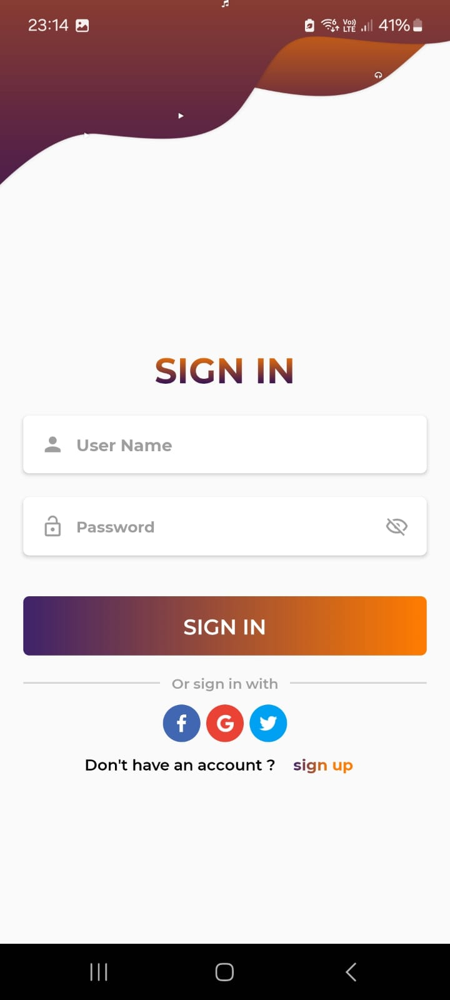
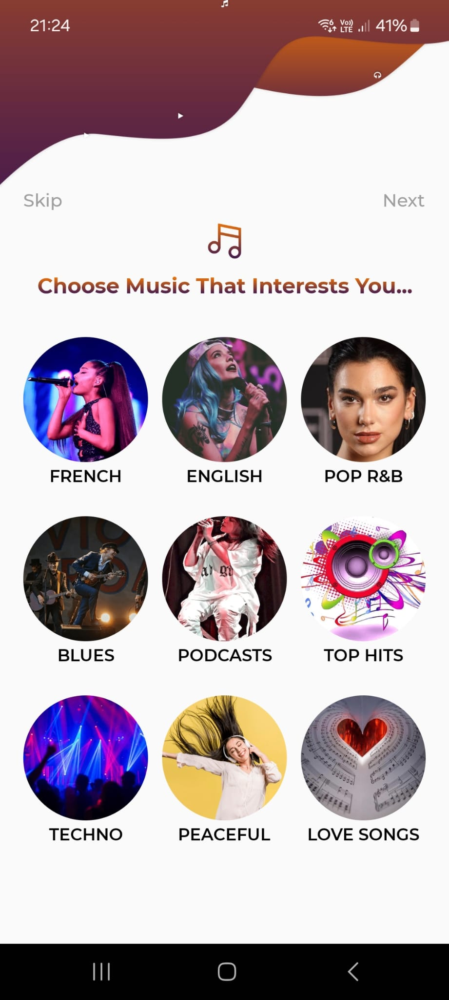
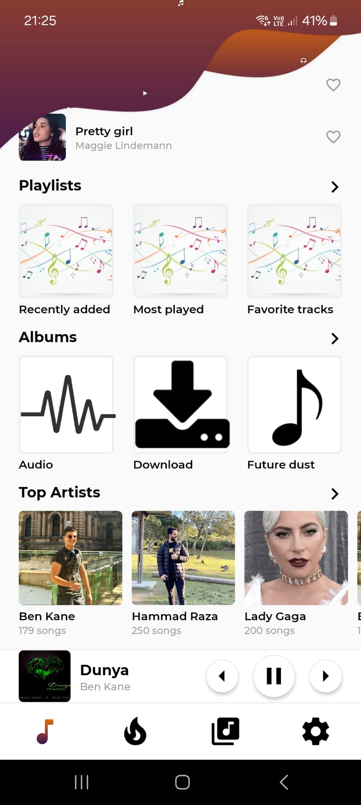
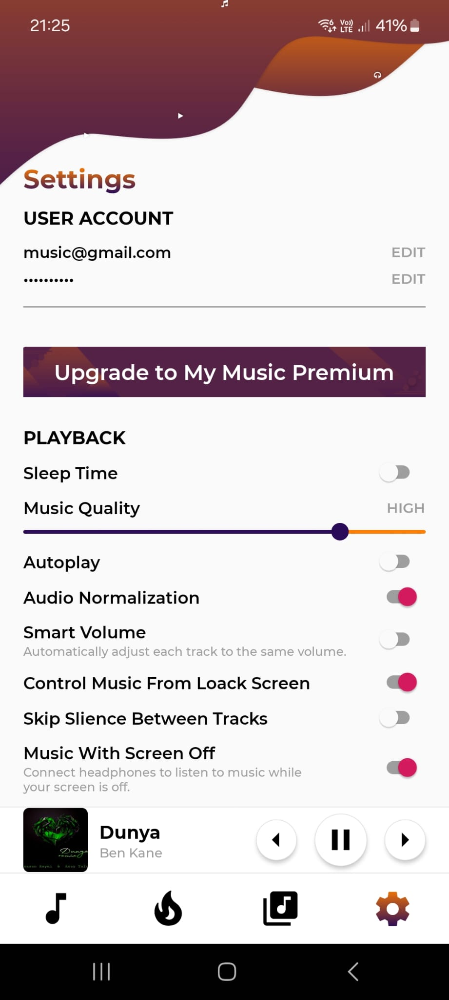

# 🎵 KeePoint: Your Personalized Music Streaming App 🎶

This is **KeePoint**, a personalized music streaming application developed using [Expo](https://expo.dev).

---

## Author

Created and maintained by Berk Can:  
GitHub Profile: [https://github.com/13erkcan](https://github.com/13erkcan)  
Feel free to reach out via GitHub for support or feedback.

---

## App Preview

| Login Screen                       | Music Selection                     |
|------------------------------------|-------------------------------------|
|  |  |

| User Dashboard                    | Settings Page                      |
|-----------------------------------|------------------------------------|
|  |  |

---

## 🎥 Video Demo

Click the link below to watch the video demo showcasing the app's UI/UX:  
[](https://www.youtube.com/watch?v=_vL4MmV5eQg)  
**[KeePoint: Personalized Music Streaming Experience (UI/UX)](https://www.youtube.com/watch?v=_vL4MmV5eQg)**

---

## Get Started 🚀

To set up and run this project, follow these steps:

1. Make sure you have **Node.js** and **npm** installed.
2. Install dependencies:
   ```bash

npm install && npx expo start

In the Expo development output, you'll find options to open the app in:

- A development build: https://docs.expo.dev/develop/development-builds/introduction/
- Android emulator: https://docs.expo.dev/workflow/android-studio-emulator/
- iOS simulator: https://docs.expo.dev/workflow/ios-simulator/
- Expo Go: https://expo.dev/go

## Features

KeePoint offers:

- Customizable playlists
- High-quality audio streaming (48 to 320 kbps)
- Download and play songs offline for premium users
- Lyrics display during playback
- Ad-free experience with a premium subscription